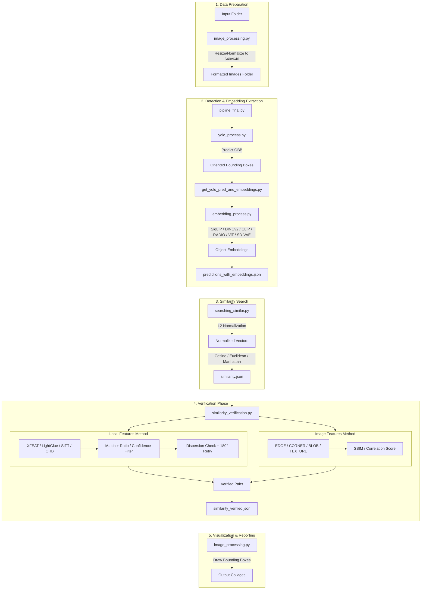

# Project Structure: YOLO Search & Similar Objects Dataset Maker

This document provides a detailed overview of the codebase logic, file system organization, and configuration settings for the YOLO object detection and similarity search pipeline.

## System Logic Diagram



---

## File System Explanation

| Path | Description |
|:---|:---|
| `src/` | **Core Source Directory** containing all module implementations. |
| `src/pipline_final.py` | **Main Entry Point**: Orchestrates the entire process from image formatting to final collage generation. |
| `src/settings_and_utils.py` | **Configuration**: Centralized class `Settings` containing all hyperparameters and directory paths. |
| `src/image_processing.py` | **Image Manipulation**: Handles resizing, OBB cropping (perspective warp), and collage generation. |
| `src/yolo_process.py` | **Object Detection**: Initializes YOLO and performs OBB (Oriented Bounding Box) predictions. |
| `src/embedding_process.py` | **Feature Extraction**: Wrappers for SigLIP, DINOv2, CLIP, RADIO, ViT, and SD-VAE embedding models. |
| `src/get_yolo_pred_and_embeddings.py` | **Data Integrator**: Bridges detection and embedding steps, iterating through images to build the primary dataset. |
| `src/searching_similar.py` | **Vector Math**: Loads embeddings, normalizes them, and performs similarity comparisons across images. |
| `src/similarity_verification.py` | **Validation Logic**: High-precision filters (XFeat, LightGlue, SIFT, Contours, Image Features) to confirm candidates from vector search. |
| `src/similarity_model_learning/` | **Training Module**: Experimental Siamese network for custom similarity metric learning. |
| `src/image_comparator.py` | **Metrics Sandbox**: 11-metric image comparison utility (SSIM, NCC, histograms, edges, etc.). |
| `requirements.txt` | **Dependencies**: All required packages. See also `pyproject.toml` for uv-managed installs. |
| `pyproject.toml` / `uv.lock` | **uv project files**: Reproducible environment managed with `uv`. |
| `train_yolo_detect.ipynb` | **Notebook**: YOLO training / fine-tuning. |
| `test_embeddings.ipynb` | **Notebook**: Sandbox for testing and visualizing embedding models. |

---

## Configuration Settings (`src/settings_and_utils.py`)

All pipeline behaviour is controlled via the `Settings` class.

### 1. Formatting & Paths
| Parameter | Default | Description |
|-----------|---------|-------------|
| `input_folder` | `embedding_test_images/` | Raw source images |
| `formated_images_folder` | `pipline_test_formated/` | Resized/normalized workspace |
| `target_width` / `target_height` | `640` | YOLO input size |

### 2. Detection & Embeddings
| Parameter | Default | Description |
|-----------|---------|-------------|
| `yolo_model_path` | `runs/obb/120/train/weights/best.pt` | Trained YOLO OBB weights |
| `embedding_model_name` | `siglip` | Embedding backend — see table below |
| `output_predictions_json_file` | `predictions_with_embeddings.json` | Cached detections + embeddings |

**Embedding model options:**

| Value | Model | Dim |
|-------|-------|-----|
| `siglip` **(default)** | `google/siglip-so400m-patch14-384` | 1152D |
| `dino` | `facebook/dinov2-large` | 1024D |
| `dino_giant` | `facebook/dinov2-giant` | 1536D |
| `clip` | `openai/clip-vit-large-patch14` | 768D |
| `radio` | `nvidia/RADIO` (timm) | 768D |
| `vit_google` | `google/vit-base-patch16-224-in21k` | 768D |
| `sd-vae` | Stable Diffusion VAE | latent |

### 3. Similarity Search
| Parameter | Default | Description |
|-----------|---------|-------------|
| `sim_tresh_cosine` | `0.65` | Cosine similarity cutoff for candidate pairs |
| `sim_tresh_euclidean` | `0.55` | Euclidean similarity cutoff (active default) |
| `sim_tresh_manhattan` | `0.04` | Manhattan similarity cutoff |

### 4. Local Features Verification
| Parameter | Default | Description |
|-----------|---------|-------------|
| `local_features_method` | `XFEAT` | Matcher: `XFEAT`, `LIGHTGLUE`, `SIFT`, `ORB` |
| `local_features_min_good_matches` | `20` | Minimum matches to pass verification |
| `local_features_ratio_thresh` | `0.8` | Lowe's ratio test threshold (SIFT/ORB only) |
| `local_features_check_dispersion` | `True` | Reject matches clustered in one small area |
| `local_features_dispersion_grid_rows` | `10` | Grid rows for dispersion check |
| `local_features_dispersion_grid_cols` | `2` | Grid columns for dispersion check |
| `local_features_dispersion_min_occupied_cells_ratio` | `0.7` | Minimum fraction of grid cells that must contain a match |
| `xfeat_top_k` | `4096` | Max keypoints for XFeat |
| `lightglue_extractor` | `superpoint` | LightGlue feature extractor: `superpoint`, `disk`, `aliked` |
| `lightglue_max_keypoints` | `2048` | Max keypoints for LightGlue extractor |
| `lightglue_confidence_threshold` | `0.5` | Minimum match confidence for LightGlue |

### 5. Image Features Verification (secondary pass)
| Parameter | Default | Description |
|-----------|---------|-------------|
| `image_features_EDGE_method` | `EDGE` | Method: `EDGE`, `CORNER`, `BLOB`, `TEXTURE` |
| `image_features_EDGE_similarity_threshold` | `0.2` | Edge-map correlation threshold |

### 6. Outputs
| Parameter | Default | Description |
|-----------|---------|-------------|
| `output_similarity_json_file_verified` | `similarity_verified.json` | Final confirmed similar pairs |
| `output_collages_dir` | `pipline_test_collage/` | Side-by-side visual proof images |

---

## Dependency Management

Dependencies are managed with `uv`:

```bash
# Install all dependencies
uv sync

# Run the pipeline
uv run python src/pipline_final.py
```

GitHub-only packages included in `uv.lock`:
- **LightGlue**: `git+https://github.com/cvg/LightGlue`
- **XFeat**: loaded at runtime via `torch.hub` (no install step needed)
