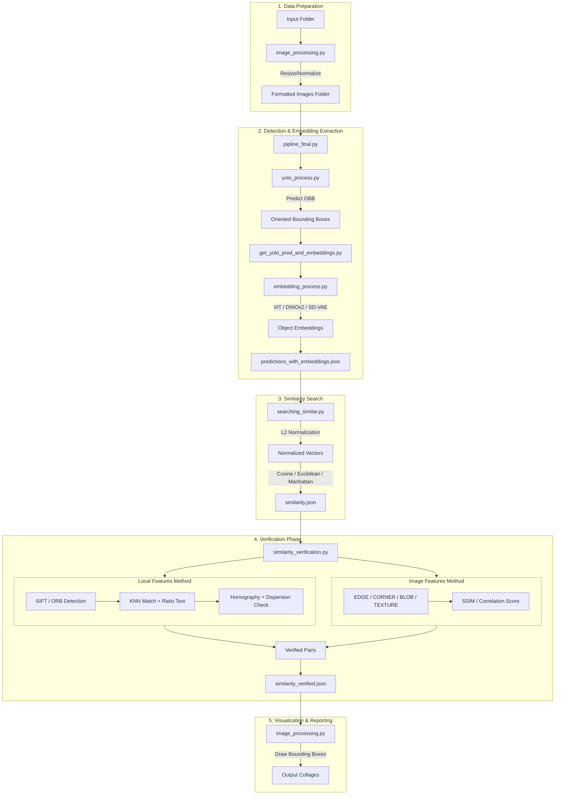

# Project Structure: YOLO Search & Similar Objects Dataset Maker

This document provides a detailed overview of the codebase logic, file system organization, and configuration settings for the YOLO object detection and similarity search pipeline.

## System Logic Diagram

The following diagram illustrates the complete end-to-end data flow and processing logic of the pipeline.

---

## File System Explanation

| Path | Description |
|:---|:---|
| `src/` | **Core Source Directory** containing all module implementations. |
| `src/pipline_final.py` | **Main Entry Point**: Orchestrates the entire process from image formatting to final collage generation. |
| `src/settings_and_utils.py` | **Configuration**: Centralized class `Settings` containing all hyperparameters and directory paths. |
| `src/image_processing.py` | **Image Manipulation**: Handles resizing, OBB cropping (perspective warp), and collage generation. |
| `src/yolo_process.py` | **Object Detection**: Initializes YOLO and performs OBB (Oriented Bounding Box) predictions. |
| `src/embedding_process.py` | **Feature Extraction**: Implements wrappers for ViT, DINOv2, and Stable Diffusion VAE to generate embeddings. |
| `src/get_yolo_pred_and_embeddings.py` | **Data Integrator**: Bridges detection and embedding steps, iterating through images to build the primary dataset. |
| `src/searching_similar.py` | **Vector Math**: Loads embeddings, normalizes them, and performs similarity comparisons across images. |
| `src/similarity_verification.py` | **Validation Logic**: High-precision filters (SIFT, Contours, Image Features) to confirm candidates from vector search. |
| `src/similarity_model_learning/` | **Training Module**: Contains code for fine-tuning Siamese networks for custom similarity tasks. |
| `requirements.txt` | **Dependencies**: Lists all required Python packages (OpenCV, PyTorch, Ultralytics, Transformers, etc.). |
| `train_yolo_detect.ipynb` | **Notebook**: Used for training or fine-tuning the YOLO detector. |
| `test_embeddings.ipynb` | **Notebook**: Sandbox for testing and visualizing different embedding models. |

---

## Configuration Settings (`src/settings_and_utils.py`)

The pipeline behavior is controlled via the `Settings` class. Below is an explanation of the key parameters:

### 1. Formatting & Paths
* `input_folder`: Directory containing raw source images.
* `formated_images_folder`: Workspace for resized/normalized images.
* `target_width` / `target_height`: Dimensions (default 640x640) for YOLO and initial processing.

### 2. Detection & Embeddings
* `yolo_model_path`: Path to the trained `.pt` weights file.
* `embedding_model_name`: Choice of feature extractor (`dino`, `vit_google`, or `sd-vae`).
* `output_predictions_json_file`: Cache file for all detected objects and their high-dimensional vectors.

### 3. Similarity Search
* `sim_tresh_cosine` / `sim_tresh_euclidean`: Thresholds for the initial broad search. Pairs with scores below these are discarded before verification.

### 4. Local Features Verification (`local_features`)
* `local_features_method`: Detection algorithm (`SIFT` or `ORB`).
* `local_features_min_good_matches`: Minimum number of passing feature matches required to verify a pair.
* `local_features_check_dispersion`: If `True`, ensures matches aren't clumped in one tiny area (prevents false positives from noise).
* `local_features_dispersion_min_occupied_cells_ratio`: Strictness of the spatial distribution check.

### 5. Image Features Verification (`image_features`)
* `image_features_method`: Secondary validation method (`EDGE`, `CORNER`, `BLOB`, or `TEXTURE`).
* `image_features_EDGE_similarity_threshold`: Threshold for edge-map correlation (higher = stricter).

### 6. Outputs
* `output_similarity_json_file_verified`: The final list of confirmed similar object pairs.
* `output_collages_dir`: Location where the final visual proof (side-by-side images with red boxes) is saved.
